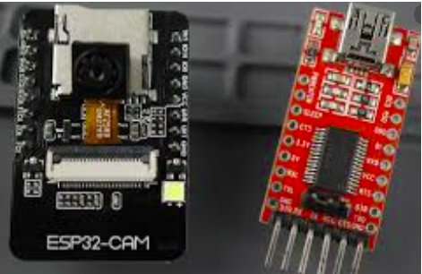
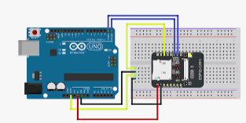
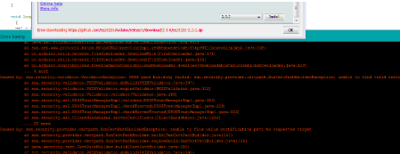
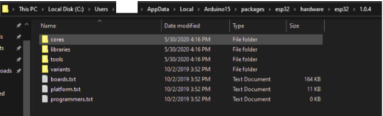
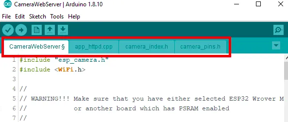

#  ESP32 Cam Module   

## Programming the board    

Using the ***FT232RL FTDI USB To TTL*** Serial Converter Adapter Module

***Connect*** 
> GND to GND  
> 5V to 5V   
> TX to UOR   
> RX to UOT   

## Using Arduino Uno   

## Add ESP32 to Arduino IDE    

### Standard method    

If you read any setup guide online, you will be told to go to File>Preference and add the following line to “Additional Boards Manager URLs”    
> https://dl.espressif.com/dl/package_esp32_index.json, http://arduino.esp8266.com/stable/package_esp8266com_index.json

Then go to Tools>Board>Boards Manager and install ESP32.    

When I tried to do this I kept getting a download error on both Windows and Linux. I tried uninstalling Arduino IDE and re-installing, as suggested by some.    

***Since this does not work for me, I had to find another way. ***   

### The work around for the above error    

I decided to got the route of adding the board manually. Download the zip file from [Espressif github]( https://github.com/espressif/arduino-esp32/releases

### For Linux    

Open your home folder and show hidden files. Open .arduino15. Create a folder named packages if one does not exist.    
Inside packages create esp32    
Inside esp32 create hardware and tools    
Inside hardware create esp32     
Inside esp32 create 1.0.4    <---- (version number)    
Extract the downloaded esp file inside 1.0.4.    

/ home / user /.arduino15/packages/esp32/hardware/esp32/1.0.4.    

### For Windows is should look something like    

ThisPC > Local Disc (C:) > Users > user> AppData > Local > Aduino15 > packages > esp32> hardware > esp32 > 1.0.4     

This not only added the board to my boards list for me, but also the example library to start experimenting with the camera.    

